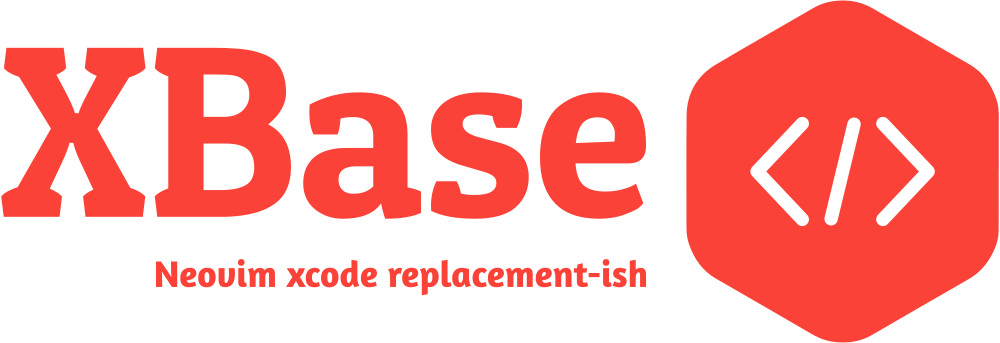

<p align="center">

</P>

An XCode replacement-ish *development environment* that aims to be your reliable XCode alternative to develop exciting new [apple] software products 🚀.

## Table of Content

- [👁  Overview]
- [🌝 Motivation]
- [🌟 Features]
- [💆 Generators]
- [🛠 Requirements]
- [🦾 Installation]
- [🎮 Usage]
- [⚙️ Defaults]
- [🩺 Debugging]
- [🎥 Preview]

## 👁 Overview

[XBase] enables you to build, watch, and run xcode products as well as swift packages from within your favorite editor. It supports running products on iOS, watchOS and tvOS simulators, along with real-time logging, and some lsp features such as auto-completion and code navigation. ([🌟 Features](#-features)).

Furthermore, [XBase] has built-in support for a variety of XCode project generators, which allow you to avoid launching XCode or manually editing '*.xcodeproj' anytime you add or remove files. We strongly advise you to use one ... at least till [XBase] supports adding/removing files and folders, along with other requirements. ([💆 Generators](#-generators))

Please be aware that [XBase] is still **WIP**, so don't hesitate to report bugs, ask questions or suggest new exciting features.


## 🌝 Motivation

I chose to dive into iOS/macOS app development after purchasing an M1 MacBook. However, coming from vim/shell environment and being extremely keyboard oriented, I couldn't handle the transition to a closed sourced, opinionated, mouse-driven development environment. I've considered alternatives like [XVim2] and the built-in vim emulator, however still, I'd catch myself frequently hunting for my mouse.

As a long-time vim user who has previously developed a several lua/nvim plugins, I decided to invest some effort in simplifying my development workflow for producing 'xOS' products.

## 🌟 Features

* **Auto-Completion and Code navigation**\
    Auto-generate compilation database on directory changes + a custom build server that assists [sourcekit-lsp] in providing code navigation and auto-completion for project symbols.
* **Multi-nvim instance support**\
    Multiple nvim instance support without process duplications and shared state. For instance, you can stop a watch service that was being run from a different instance.
* **Auto-start/stop main background daemon**\
    Daemon will start and stop automatically based on the number of connected client instances.
* **Multi Target/Project Support**\
    Work on multiple projects at one nvim instance at the same time.
* **Simulator Support**\
    Run your products on simulators relative to your target's platform. (+ watch build and ran on change)
* **Runtime/Build Logging**\
    Real-time logging of build logs and 'print()' commands
* **Statusline Support**\
    Global variable to update statusline with build/run commands, see [Statusline](#statusline)
* **Zero Footprint**\
    Light resource usage. I've been using [XBase] for a while; it typically uses 0.1 percent RAM and 0 percent CPU.
* **Multi XCodeProj Generator Support**\
    Auto-generate xcodeproj, when it doesn't exists, generator config files a updated or new files/directories added or removed.
* **Swift Package Support**\
    Auto-generate when `.build` folder doesn't exists, Package.swift file is updated or new files or directories are added or removed.

## 💆 Generators

[XBase] primarily supports two project generators: [XcodeGen] and [Tuist].

[XCodeGen] is **recommended** if you are just starting started with `xcodeproj generators`
since it is considerably simpler with a yml-based configuration language. Having said that,
[Tuist] is more powerful and packed with features, of which `xcodeproj generation` is but one.

[XBase]'s support for generators is available in the following forms:

- Identification.
- Auto-generate xcodeproj if you haven't haven't generate it by hand.
- Auto-generate xcodeproj when you edit the generator config files.
- Auto-compile project when xcodeproj get regenerated.
- Code Completion and navigation (#tuist)

### Limitations

#### [XCodeGen]

- No support for custom named yml config files, only `project.yml`.

#### Other Generators

With current [XBase] architecture, it should be pretty easy to add support for yet another
awesome xcodeproj generator. feel free to get started with [CONTRIBUTING.md] or open a github
issue

## 🛠 Requirements

- [neovim] v0.7.0 or nightly
- [lspconfig]
- [rust] 1.60.0 or up (see [rust getting started])
- [telescope.nvim]
- [plenary.nvim]

## 🦾 Installation

To install [XBase] on your system you need run `make install`. This will run `cargo build
--release` and resulting binrary to `~/.local/share/xbase/`.


#### With [packer]
```lua
use {
  'xbase-lab/xbase',
    run = 'make install', -- make free_space (not recommended, longer build time)
    requires = {
      "nvim-lua/plenary.nvim",
      "nvim-telescope/telescope.nvim",
      "neovim/nvim-lspconfig"
    },
    config = function()
      require'xbase'.setup({})  -- see default configuration bellow
    end
}
```

#### With [vim-plug]
```vim
Plug 'nvim-lua/plenary.nvim'
Plug 'nvim-telescope/telescope.nvim'
Plug 'neovim/nvim-lspconfig'
Plug 'xbase-lab/xbase', { 'do': 'make install' }
lua require'xbase'.setup()
```

#### With [dein]
```vim
call dein#add('nvim-lua/plenary.nvim')
call dein#add('nvim-telescope/telescope.nvim')
call dein#add('neovim/nvim-lspconfig')
call dein#add('xbase-lab/xbase', { 'build': 'make install' })
lua require'xbase'.setup()
```

> **NOTE:** You need to setup sourcekit-lsp (see [sourcekit-setup]) and consider adding more
> file to root patterns

## 🎮 Usage

TLDR:
- [Install XBase](#-installation)
- run `require'xbase'.setup({ --[[ see default configuration ]]  })`
- Open xcodeproj codebase.
- Wait for first time project setup finish.
- Start coding
- Use available actions which can be configure with shortcuts bellow

When you start a neovim instance with a root that contains `project.yml,` `Project.swift,` or
`*.xcodeproj,` the daemon server will auto-start if no instance is running, and register the
project once for recompile-watch. To communicate with your daemon, checkout the configurable
shortcuts.

### Statusline

[XBase] provide [feline] provider, other statusline plugins support are welcomed. However,
using `vim.g.xbase_watch_build_status` you can easily setup statusline indicators.

```lua
require("xbase.statusline").feline() -- append to feline setup function
```


## ⚙️ Defaults
```lua
-- NOTE: Defaults
{
  --- Log level. Set it to ERROR to ignore everything
  log_level = vim.log.levels.DEBUG,
  --- Options to be passed to lspconfig.nvim's sourcekit setup function.
  --- Usually empty map is sufficient, However, it is strongly recommended to use on_attach key to setup custom mapppings
  sourcekit = {}, --- Set it to nil to skip lspconfig's sourcekit setup
  --- Statusline provider configurations
  statusline = {
    watching = { icon = "", color = "#1abc9c" },
    device_running = { icon = "", color = "#4a6edb" },
    success = { icon = "", color = "#1abc9c" },
    failure = { icon = "", color = "#db4b4b" },
  },
  --- TODO(nvim): Limit devices platform to select from
  simctl = {
    iOS = {
      "iPhone 13 Pro",
      "iPad (9th generation)",
    },
  },
  --- Log buffer configurations
  log_buffer = {
    --- Whether toggling the buffer should auto focus to it?
    focus = true,
    --- Split Log buffer height
    height = 20,
    --- Vsplit Log buffer width
    width = 75,
    --- Default log buffer direction: { "horizontal", "vertical" }
    default_direction = "horizontal",
  },
  --- Mappings
  mappings = {
    --- Whether xbase mapping should be disabled.
    enable = true,
    --- Open build picker. showing targets and configuration.
    build_picker = "<leader>b", --- set to 0 to disable
    --- Open run picker. showing targets, devices and configuration
    run_picker = "<leader>r", --- set to 0 to disable
    --- Open watch picker. showing run or build, targets, devices and configuration
    watch_picker = "<leader>s", --- set to 0 to disable
    --- A list of all the previous pickers
    all_picker = "<leader>ef", --- set to 0 to disable
    --- horizontal toggle log buffer
    toggle_split_log_buffer = "<leader>ls",
    --- vertical toggle log buffer
    toggle_vsplit_log_buffer = "<leader>lv",
  },
}
```


## 🩺 Debugging

Sometimes xcodebuild acts up and things might break, the first step to find the root cause is
to check logs. The following is how you can have a stream of logs in your terminal.

```bash
# Daemon logs
tail -f /tmp/xbase.log
# Build Server logs
tail -f /tmp/xbase-build-server.log
```

In case, you need to manually stop servers:

```bash
killall xbase xbase-sourcekit-helper
```

[xcodegen]: https://github.com/yonaskolb/XcodeGen
[sourcekit-lsp]: https://github.com/apple/sourcekit-lsp
[XBase]: https://github.com/xbase-lab/xbase
[xcodebuild]: https://github.com/xbase-lab/xcodebuild
[feline]: https://github.com/feline-nvim/feline.nvim
[XVim2]: https://github.com/XVimProject/XVim2
[rust]: https://www.rust-lang.org
[tuist]: https://github.com/tuist/tuist
[dein]: https://github.com/Shougo/dein.vim
[packer]: https://github.com/wbthomason/packer.nvim
[vim-plug]: https://github.com/junegunn/vim-plug
[rust getting started]: https://www.rust-lang.org/tools/install
[telescope.nvim]: https://github.com/nvim-telescope/telescope.nvim
[plenary.nvim]: https://github.com/nvim-lua/plenary.nvim
[neovim]: https://github.com/neovim/neovim
[tuist]: https://github.com/tuist/tuist
[dev.md]: ./dev.md
[lspconfig]: https://github.com/neovim/nvim-lspconfig
[sourcekit-setup]: https://github.com/neovim/nvim-lspconfig/blob/master/doc/server_configurations.md#sourcekit
[apple]: https://github.com/apple

[👁  Overview]: #-motivation
[🌝 Motivation]: #-motivation
[🌟 Features]: #-features
[💆 Generators]: #-generators
[🛠 Requirements]: #-requirements
[🎮 Usage]: #-usage
[🦾 Installation]: #-installation
[⚙️ Defaults]: #-defaults
[🩺 Debugging]: #-debugging
[🎥 Preview]: #-preview
